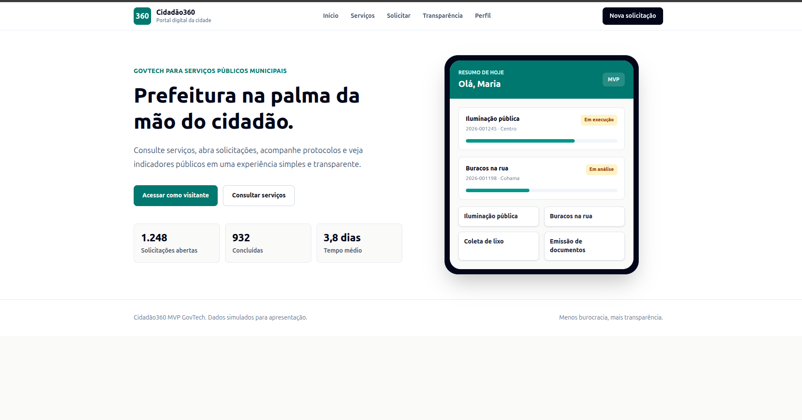
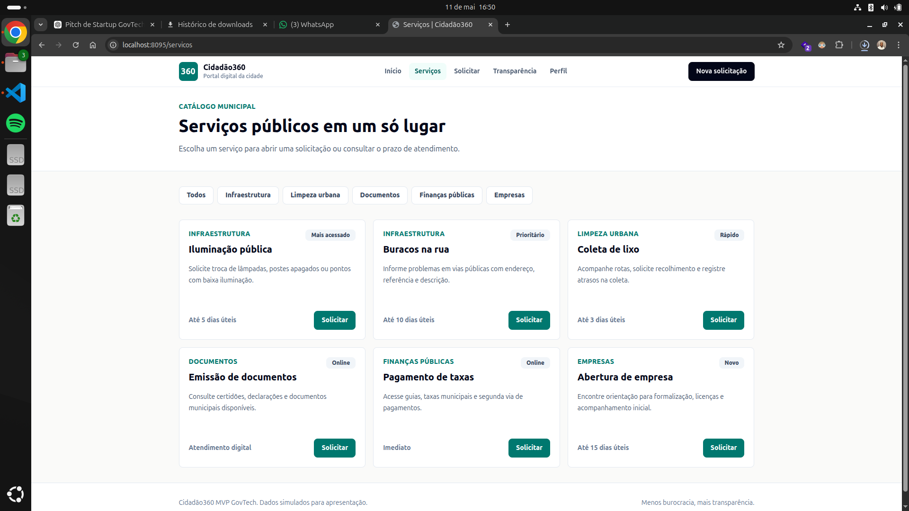
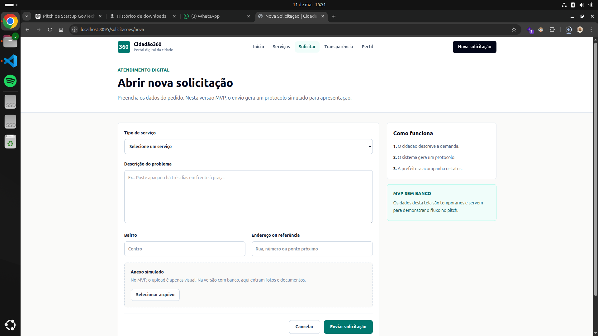
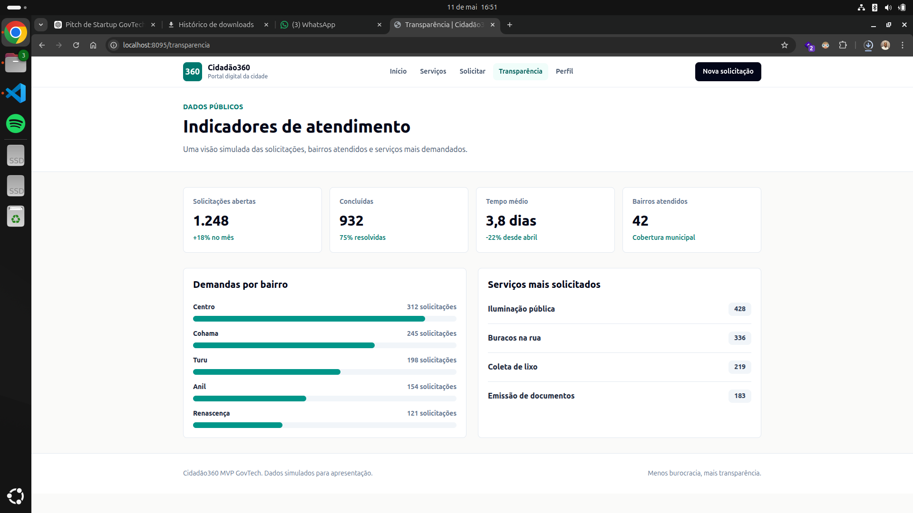
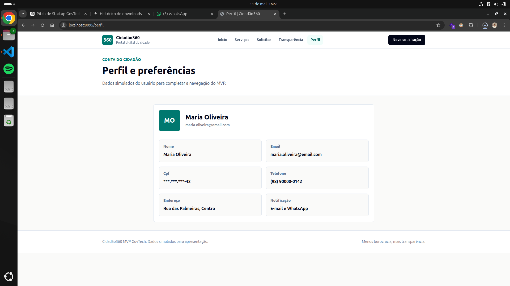
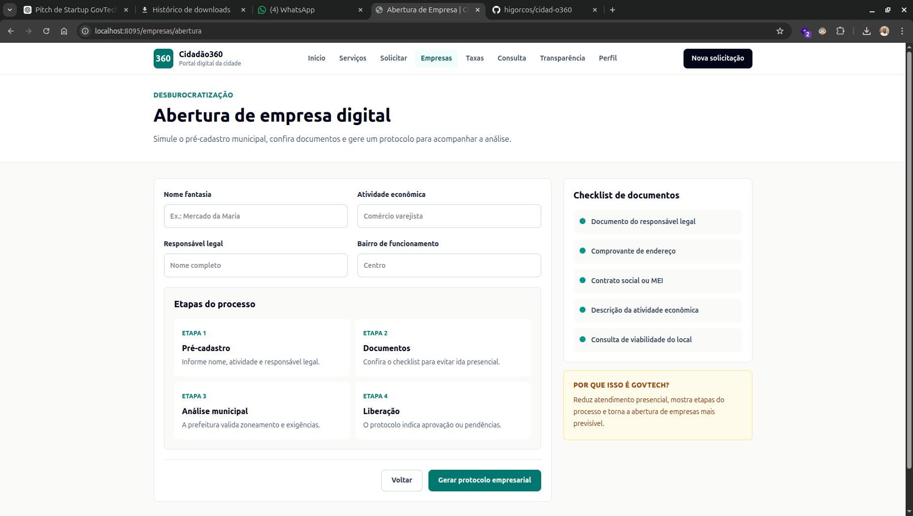
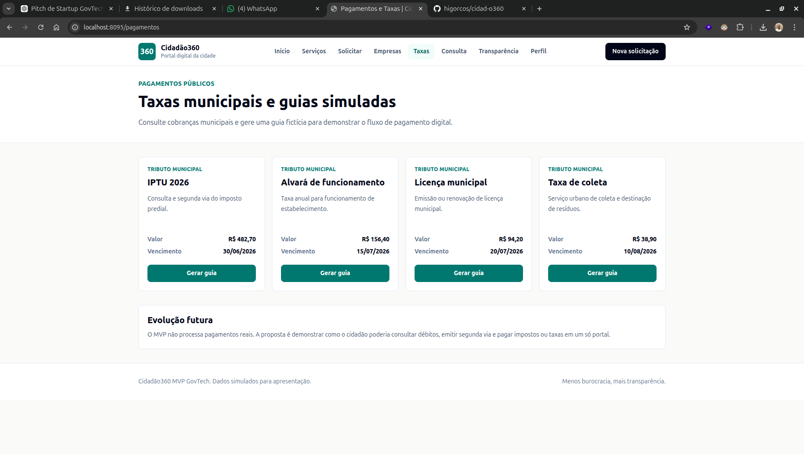
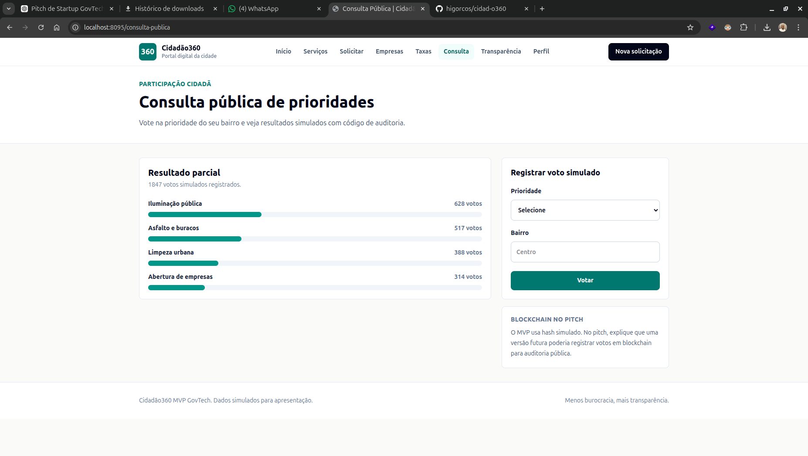
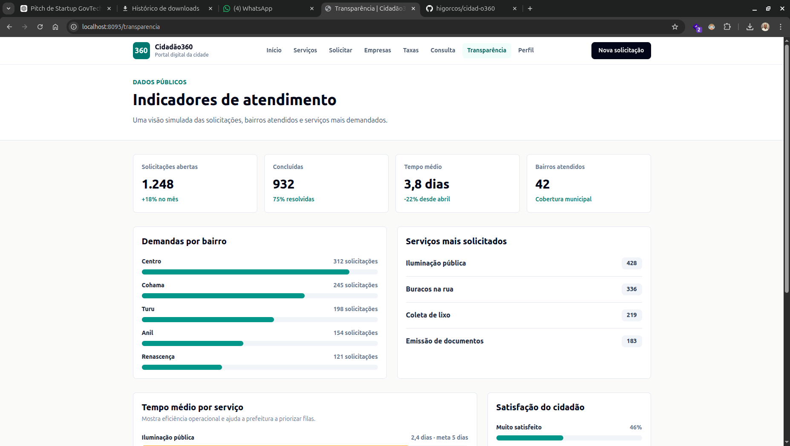
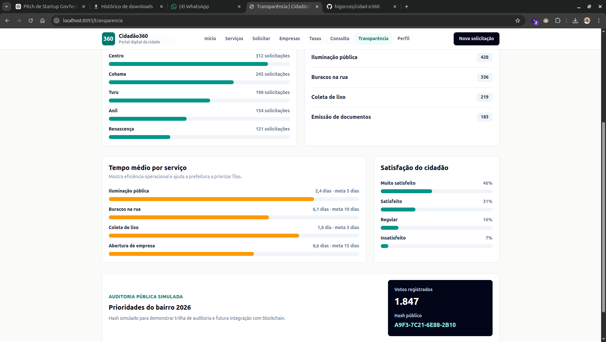

# Cidadão360

O **Cidadão360** é um projeto de startup GovTech criado para a P2. A ideia é simples: juntar em um só lugar alguns serviços que normalmente fazem o cidadão perder tempo, como abrir solicitação na prefeitura, acompanhar protocolo, consultar taxas, participar de consulta pública e ver dados de transparência.

O projeto foi feito como um **MVP funcional em Laravel**, com telas navegáveis e dados simulados. Nesta primeira versão, a intenção não é ter um sistema completo com banco de dados real, e sim mostrar a proposta funcionando para o pitch.

## Tema Escolhido

**GovTech: Tecnologia para Governos**

Esse tema fala sobre usar tecnologia para melhorar serviços públicos, deixar processos mais transparentes e diminuir burocracias. Por isso, o Cidadão360 foi pensado como um portal digital entre o cidadão e a prefeitura.

## Problema

Hoje muitos serviços públicos ainda são confusos ou muito manuais. O cidadão nem sempre sabe:

- onde pedir um serviço;
- quais documentos precisa enviar;
- como acompanhar um protocolo;
- onde consultar taxas;
- como participar de decisões públicas;
- se a prefeitura está resolvendo as demandas.

Do lado da prefeitura, também existe dificuldade para organizar pedidos, acompanhar prazos e mostrar dados para a população.

## Solução

A solução proposta é um portal chamado **Cidadão360**, onde o cidadão consegue:

- consultar serviços públicos;
- abrir solicitações;
- acompanhar protocolos;
- simular abertura de empresa;
- consultar e gerar guias de taxas;
- participar de uma consulta pública;
- ver indicadores de transparência.

Assim, o projeto mostra como a tecnologia pode ajudar a prefeitura a atender melhor e o cidadão a acompanhar tudo com mais clareza.

## O que foi melhorado para cumprir o tema GovTech

Depois de analisar melhor o enunciado, o projeto foi ampliado para não ficar só em chamados urbanos. Foram adicionadas partes que têm mais relação com GovTech:

### 1. Transparência Pública

Foi criada uma área com indicadores simulados, como:

- solicitações abertas;
- solicitações concluídas;
- tempo médio de atendimento;
- demandas por bairro;
- serviços mais solicitados;
- satisfação do cidadão;
- auditoria pública simulada.

Isso ajuda a mostrar a parte de **plataforma de transparência**.

### 2. Abertura de Empresa

Foi adicionada uma tela de **abertura de empresa digital**, com:

- pré-cadastro;
- atividade econômica;
- responsável legal;
- bairro de funcionamento;
- etapas do processo;
- checklist de documentos;
- protocolo empresarial simulado.

Essa parte atende diretamente a ideia de **desburocratizar a abertura de empresas**.

### 3. Pagamentos e Taxas

Também foi criada uma tela para simular pagamentos públicos, com:

- IPTU;
- alvará de funcionamento;
- licença municipal;
- taxa de coleta;
- geração de guia fictícia.

Essa funcionalidade conversa com a parte do tema que fala sobre **pagamento de impostos e taxas**.

### 4. Consulta Pública

Foi criada uma consulta pública simulada, onde o cidadão vota em uma prioridade para o bairro. A tela mostra:

- opções de votação;
- resultado parcial;
- quantidade de votos;
- hash de auditoria simulado.

O hash serve para explicar no pitch que, em uma versão futura, essa votação poderia usar **blockchain** para aumentar segurança e transparência.

## Pitch Resumido

O Cidadão360 é uma plataforma GovTech que coloca a prefeitura mais perto do cidadão. Pelo sistema, é possível consultar serviços, abrir solicitações, acompanhar protocolos, iniciar abertura de empresa, gerar guias de taxas e participar de consultas públicas.

A proposta é diminuir burocracia, aumentar a transparência e facilitar o atendimento público usando tecnologia.

## Telas do MVP

O MVP tem as seguintes telas:

- tela inicial;
- dashboard do cidadão;
- lista de serviços;
- formulário de nova solicitação;
- acompanhamento de protocolo;
- abertura de empresa;
- pagamentos e taxas;
- consulta pública;
- transparência pública;
- perfil do cidadão.

## Rotas Principais

```text
GET  /                         Tela inicial
GET  /dashboard                Dashboard do cidadão
GET  /servicos                 Lista de serviços
GET  /solicitacoes/nova        Formulário de solicitação
POST /solicitacoes             Gera protocolo simulado
GET  /empresas/abertura        Abertura de empresa
POST /empresas/abertura        Gera protocolo empresarial
GET  /pagamentos               Taxas e guias simuladas
GET  /consulta-publica         Consulta pública
POST /consulta-publica/votar   Registra voto simulado
GET  /protocolos/{id}          Acompanhamento de protocolo
GET  /transparencia            Indicadores públicos
GET  /perfil                   Perfil do usuário
```

## Tecnologias Usadas

- Laravel 13
- Laravel Sail
- Docker
- Blade
- Vite
- Tailwind CSS 4
- PHPUnit

O projeto também já tem PostgreSQL, Redis e Mailpit configurados no Docker, pensando em uma evolução futura.

## Como Rodar o Projeto

Com Docker e Sail:

```bash
./vendor/bin/sail up -d
./vendor/bin/sail npm run dev
```

Acesse:

```text
http://localhost:8095
```

Sem Docker:

```bash
composer install
npm install
npm run build
php artisan serve --port=8095
```

## Testes

Para rodar os testes:

```bash
php artisan test
```

Com Sail:

```bash
./vendor/bin/sail artisan test
```

## Estrutura Principal

```text
app/Http/Controllers/CidadaoController.php
routes/web.php
resources/views/home.blade.php
resources/views/dashboard.blade.php
resources/views/servicos/index.blade.php
resources/views/solicitacoes/create.blade.php
resources/views/protocolos/show.blade.php
resources/views/empresas/abertura.blade.php
resources/views/pagamentos/index.blade.php
resources/views/consulta-publica/index.blade.php
resources/views/transparencia/index.blade.php
resources/views/perfil/show.blade.php
```

## Personas

### Maria, cidadã comum

Maria tem 42 anos e trabalha como comerciante. Ela quer resolver problemas do bairro sem precisar ir até a prefeitura. O app ajuda porque ela consegue abrir solicitação e acompanhar o protocolo pelo celular.

### João, servidor público

João tem 35 anos e trabalha no atendimento da prefeitura. Ele precisa organizar melhor os pedidos que chegam por telefone, papel e atendimento presencial. O Cidadão360 ajuda centralizando as demandas.

### Ana, gestora pública

Ana tem 50 anos e trabalha na gestão municipal. Ela precisa de dados para tomar decisões melhores. A área de transparência ajuda a enxergar quais bairros e serviços precisam de mais atenção.

## Arquitetura da Informação

```text
Cidadão360
|
|-- Início
|   |-- Serviços em destaque
|   |-- Protocolos recentes
|   |-- Indicadores resumidos
|
|-- Serviços Públicos
|   |-- Infraestrutura
|   |-- Limpeza urbana
|   |-- Documentos
|   |-- Finanças públicas
|   |-- Empresas
|   |-- Consulta pública
|
|-- Solicitações
|   |-- Nova solicitação
|   |-- Protocolo
|   |-- Linha do tempo
|
|-- Empresas
|   |-- Pré-cadastro
|   |-- Checklist de documentos
|   |-- Protocolo empresarial
|
|-- Pagamentos
|   |-- IPTU
|   |-- Alvará
|   |-- Licença municipal
|   |-- Taxa de coleta
|   |-- Guia simulada
|
|-- Consulta Pública
|   |-- Voto por prioridade
|   |-- Resultado parcial
|   |-- Hash de auditoria
|
|-- Transparência
|   |-- Indicadores
|   |-- Demandas por bairro
|   |-- Serviços mais solicitados
|   |-- Tempo médio de atendimento
|   |-- Satisfação do cidadão
|   |-- Auditoria pública simulada
|
|-- Perfil
    |-- Dados do usuário
    |-- Endereço
    |-- Preferências
```


## Frase Final do Pitch

> Com o Cidadão360, a prefeitura fica na palma da mão do cidadão: menos burocracia, mais transparência e serviços públicos mais eficientes.

## Imagens do Projeto

Algumas imagens/mockups usados para mostrar melhor a ideia visual do Cidadão360:




















